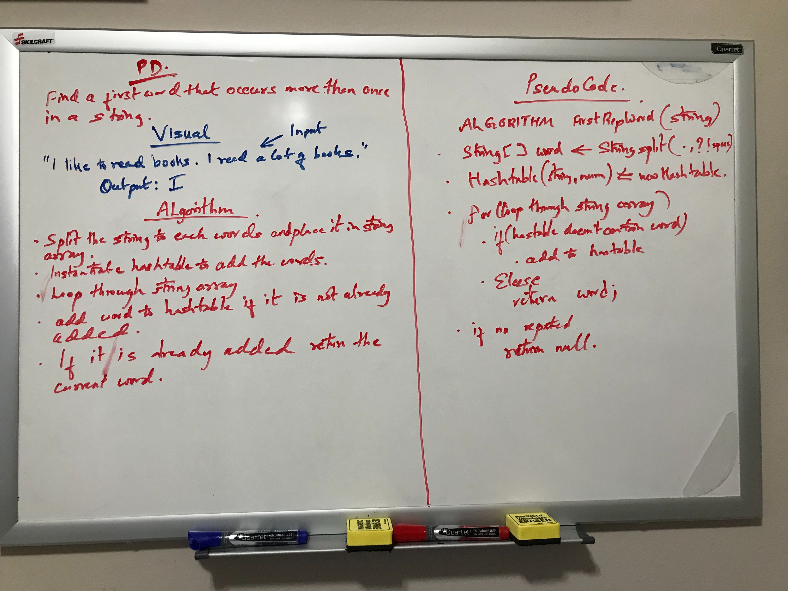

# Challenge Summary
<!-- Short summary or background information -->
Finding a first repeated word in a string

## Challenge Description
<!-- Description of the challenge -->
The given string can be from empty string to any length. Things to account for are the casing of the 
word, handle empty string, handle unrepeated string.

## Approach & Efficiency
<!-- What approach did you take? Why? What is the Big O space/time for this approach? -->
String is first split into words array and hash table is used to compare and add the word in 
the hashtable. If the hashtable already has the word in it, it returns that word as a first repeated
word in a string. This approach has a space complexity of O(n) because of creating 
new array and hashtable. Time complexity is O(n) also because it creates new array and compares each 
element in the array to get repeated words.

## Solution
<!-- Embedded whiteboard image -->
;