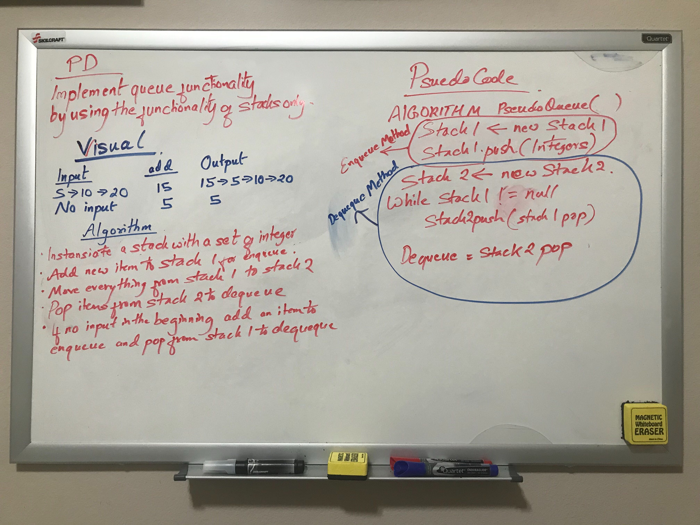

# Challenge Summary
Creating a queue using two stacks and its methods to create queue enqueue and dequeue method

## Approach & Efficiency
<!-- What approach did you take? Why? What is the Big O space/time for this approach? -->
Enqueue items go to first stack and transferred to second stack for dequeue. In second stack pop is dequeue. 
To add more items. Second stack items are moved to first stack and then new items are added. The Big O efficiency for 
Space is O(1) and time is O(1) for enqueue whereas dequeue Space efficiency is O(n) and time is O(1);

## Solution
<!-- Embedded whiteboard image -->

;
