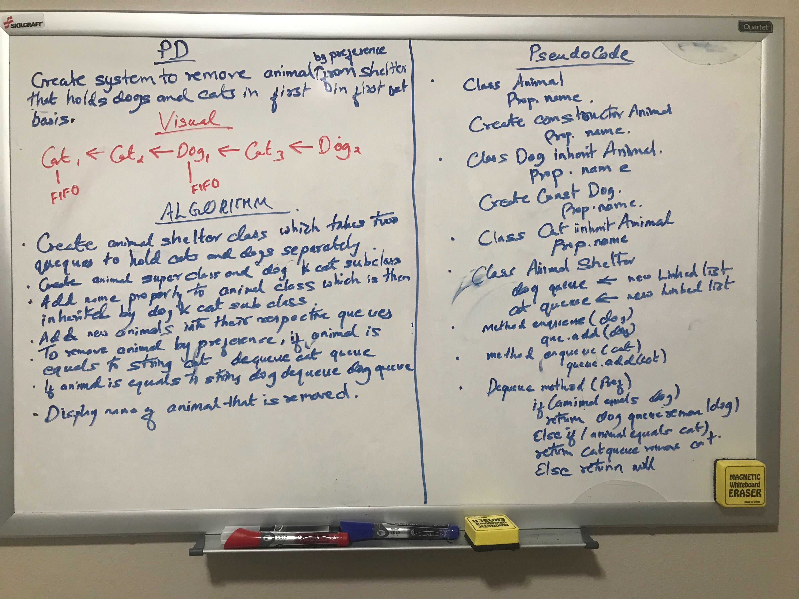

# Animal Shelter
<!-- Short summary or background information -->
Animal shelter holds dogs and cats. Remove dogs and cats based on the preference of a dog or a cat in first-in-first-out 
basis. 

## Approach & Efficiency
<!-- What approach did you take? Why? What is the Big O space/time for this approach? -->
Creating two queues to add dogs and cats separately. New animals are added to their respective queues creating two 
enqueue methods. Based on the preference dog or cat, animal is removed from the respective queues using if else statement. 
Big O space and time for enqueue are O(n) and O(1) respectively. 
Big O time for dequeue is O(1)

## Solution
<!-- Embedded whiteboard image -->
