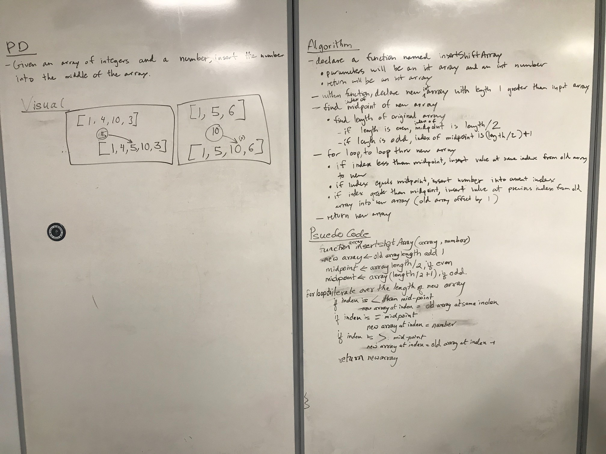

# Reverse an Array
<!-- Short summary or background information -->
Given the integer array and a number, creating a new array adding that number in the middle of the array. 
## Challenge
<!-- Description of the challenge -->
Challenge was to finding a midpoint when the array is odd length array.

## Approach & Efficiency
<!-- What approach did you take? Why? What is the Big O space/time for this approach? -->
Declare the new array, find the midpoint of old array, Before midpoint adding the same value from old 
array, at midpoint adding the number and after midpoint adding the previous index value to the new array.

## Solution
<!-- Embedded whiteboard image -->
