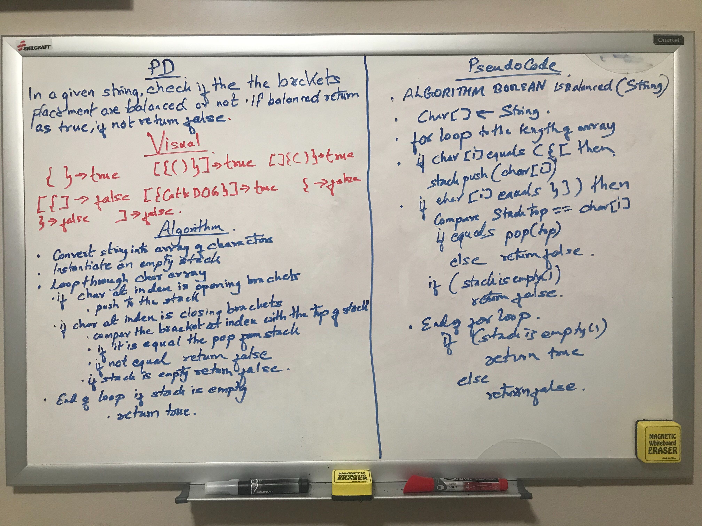

# Challenge Summary
<!-- Short summary or background information -->
Finding whether the different brackets placement in the given string are balanced or not. 

## Challenge Description
<!-- Description of the challenge -->
Creating a function that takes in string as its only argument and returns true or false identifying the different 
brackets placement are in the right order or not. 

## Approach & Efficiency
<!-- What approach did you take? Why? What is the Big O space/time for this approach? -->
First, converting string to character array. Then, iterating through each characters in array and placing the opening braces
in the stack and then compare closing braces with the opening braces in the stack. If the brace at current index match 
with the top, pop the opening brace, iterate and compare again. If the braces doesn't match, return false. If the stack
is empty at the end return true. Big O space is O(n) and Big O time is O(n) for this approach.

## Solution
<!-- Embedded whiteboard image -->
;