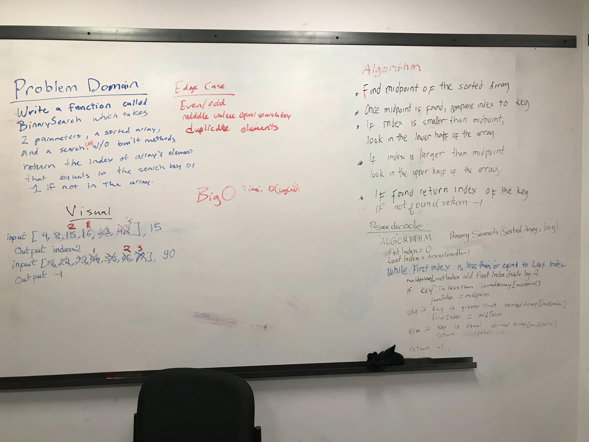

# Challenge Summary
Given the sorted array and the search key to find in the array, find the index 
of the search key.

## Challenge Description
Having Big O in mind, finding the search key index in the shortest search time 
possible.

## Approach & Efficiency
<!-- What approach did you take? Why? What is the Big O space/time for this approach? -->
Finding the mid point, if search key is greater than midpoint, search greater half 
portion of the array, with new midpoint, if search key is smaller than
midpoint, search the lower portion of the array. 

## Solution
<!-- Embedded whiteboard image -->
;