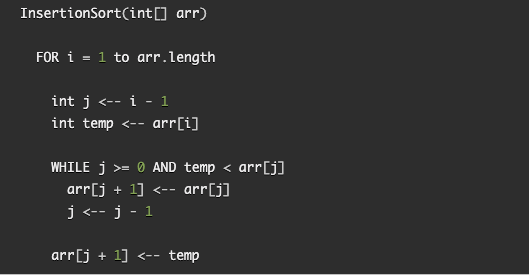
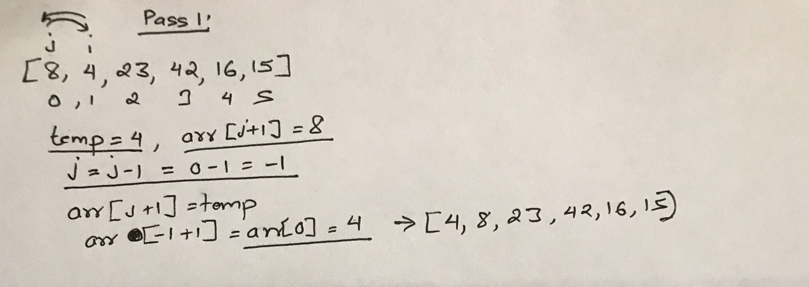
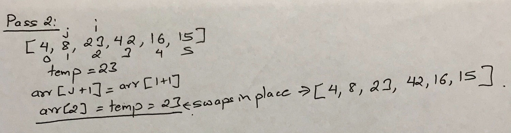
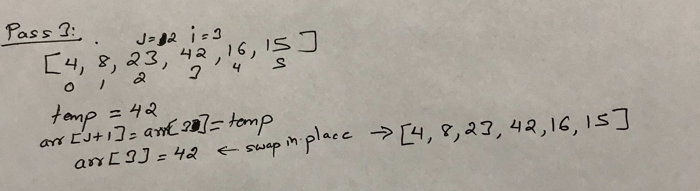
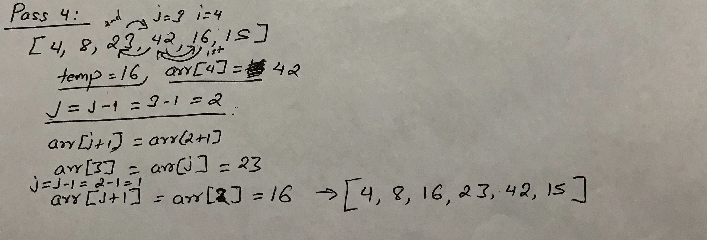
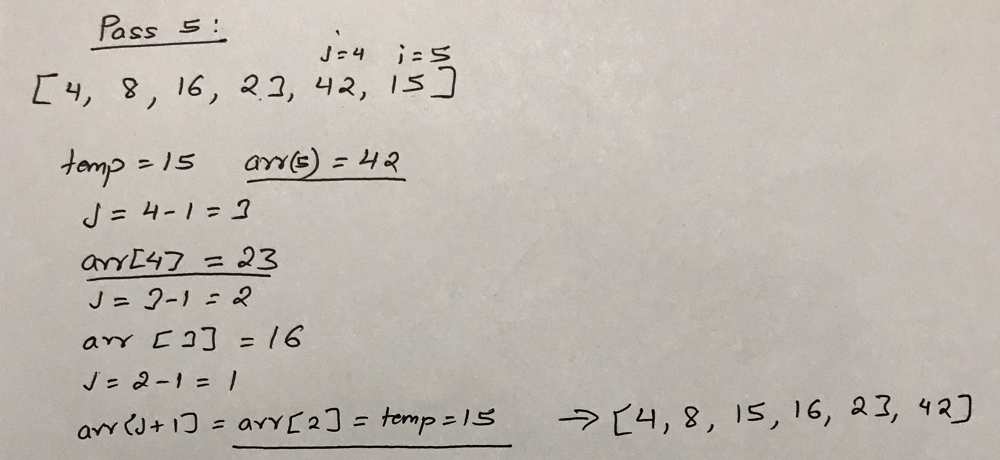

## Insertion Sort

Insertion sort is a simple sorting algorithm that sort the final sorted array one at a time.

### Pseudocode

#### Pass 1

In the given array above, on the first pass, first element and second elements are compared. Each element is visited using 
for loop to the length of the array. Index variables are assigned to point to first and second element. While the temp is less 
than the first element and the index is greater or equals to first index then second element is replace by the first element. And 
then first index is reduced by one to see if the temp can be compared to index before the current. Since there is no index 
before the first index, it then replace first element with the temp value which was the second element.

#### Pass 2

In second pass second and third index elements are compared. Third element is placed in temp. Since the third element 
value is not less than the second element, it skips the while loop. Then, the third element is swapped back with the 
same value that was in the temp.

#### Pass 3

In third pass third and fourth elements are compared. Since fourth value is not smaller than third value, it follows 
the same step like in pass 2. 

#### Pass 4

In fourth pass fifth element is compared with fourth element first. Since fifth is smaller than the fourth, it goes 
in the while loop, replaces fifth element with fourth element value. Sets the fourth index to third index, then again
goes in loop. Since the fifth element is still smaller than third element, it replaces the fourth element with third 
element value. Again, sets the third index to look into second index. Now, the fifth index value is not smaller than
second index value. Then, the third index is replace by fifth index value.

### Pass 5

In fifth pass, first it compares sixth and fifth element. Sixth element is placed in temp first. Sixth is smaller than
fifth. So, sixth element is replaced by fifth element value. Then fifth index variable is change to fourth index.
Sixth element is smaller than fourth element. So, fifth element is replaced by fourth element value. Fourth index variable 
is changed to third index. Sixth element is less than third element. So, third element is moved up and replaces fourth 
element value. Again, third index variable is changed to second index. Now, sixth is not smaller than second. 

## Efficiency

Time: O(n^2) 

Space: O(1)

