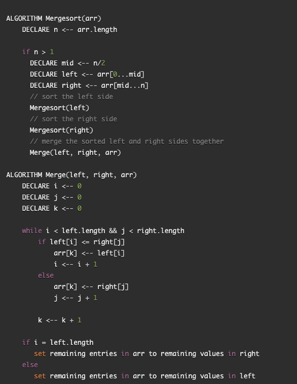
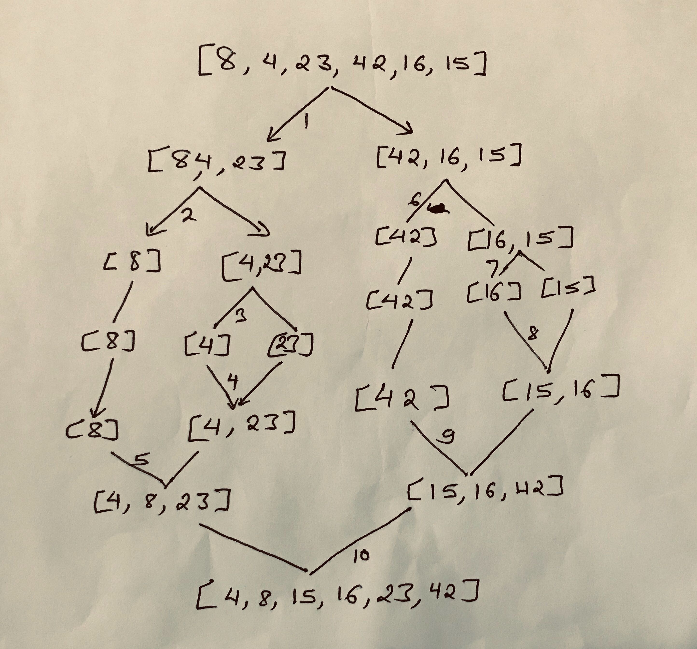

## Merge Sort
Merge sort is a way to sort the array in which the array is divided into two halves 
until the left and right element is 1 element array. At that point left and right arrays
are compared to sort and then merged together. Sort and merge continues until it gets 
all the elements of original array.

### PseudoCode

### Visual

#### Pass1
On pass 1, original array is first divided into left and right half. Then left array is recursively called to divide
into it's half until the left array is one element array. Left is one element [8] and right is two element[4, 23]. Now
the right array is called recursively to break down to one element array. When right is also one element array with left
[4] and right[23], it sorts and merges left and right to [4, 23]. It again sorts and merge left [8] and right [4, 23] to
[4, 8, 23]. 

#### Pass 2
On pass 2, second half of the divided original array [42, 16, 15] is divided into halves until left of it is one element
array [42]. Then gets the right side [16, 15] and divides into [16] and [15]. Now it sorts and merges the individual
array to [15, 16]. Arrays are merged again to include [15, 16, 42]. 

#### Pass 3. 
On the third pass, there is no left and right to break down. Now it gets the left [4, 8, 23] and right [15, 16, 42] to 
sort and merge to get [4, 8, 15, 16, 23, 42].

### Efficiency
Big O time: O(nlog(n))

Big O space: O(n)

