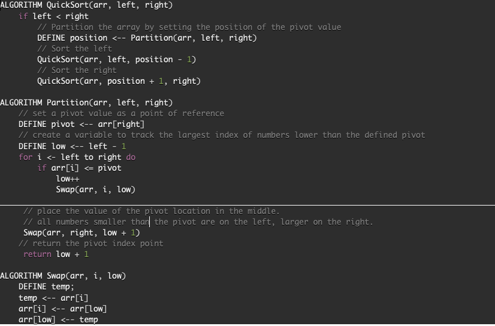
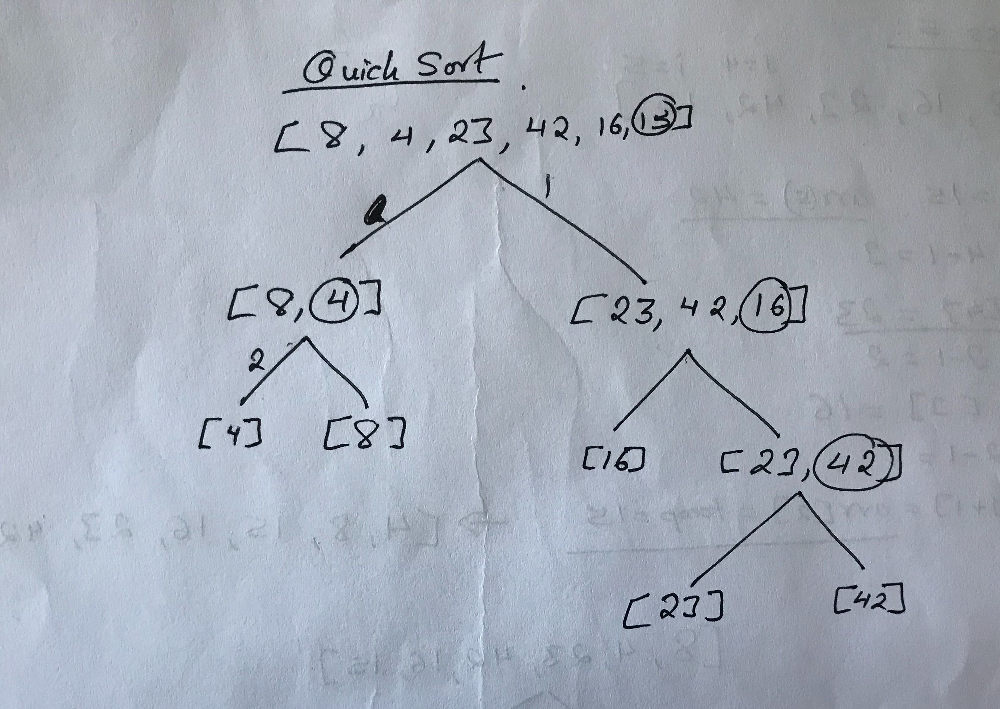

## Quick Sort

Quick sort sorts an array by picking an element as a pivot point and partition the given array around 
the picked pivot. In the given example below last element is always picked as a pivot element. Pivot 
element is put into its correct place by putting all the elements smaller than pivot before the pivot
element and putting all the elements greater than pivot after pivot element. 

### Pseudocode

### Visual

#### Pass1
Last element [15] is picked as pivot. All the elements smaller than 15 is placed to it's left and 
elements greater than 15 is placed to it's right. 

#### Pass2
New pivot element [4] is picked. Swaps the first and second element [4, 8].

#### Pass3
New pivot element [16] is selected to pivot around it. Sorted element gets [16, 23, 42].

#### Pass4
New pivot element 42, is selected to pivot. Since, the elements are already in order it swaps in its place. 

### Efficiency
In the worst case scenario when it has sort and replace every single element the operation cost of time complexity is
O(n^2) whereas in its best case scenario time complexity is O(n log(n)). Since, it doesn't create new array and only
need temporary holders for the elements the operation cost of space is constant O(1).

