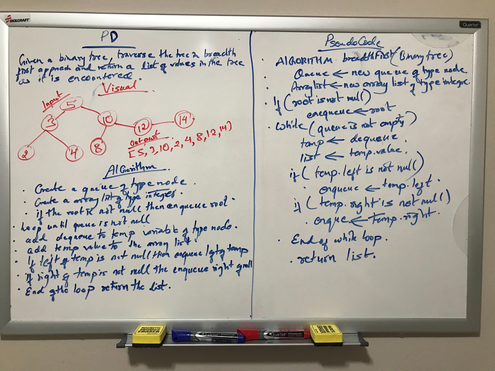

# Challenge Summary
<!-- Short summary or background information -->
Given a tree, search the elements of the tree in breadth first approach.

## Challenge Description
<!-- Description of the challenge -->
Tree can be of any data type. Traversing the tree in a way that it searches for all the 
elements at one level of the tree before moving onto the next level and subsequently 
move to the next level and search all the elements in that level and so on. 

## Approach & Efficiency
<!-- What approach did you take? Why? What is the Big O space/time for this approach? -->
As searching through the tree, nodes are added into the queue and dequeue after the 
the nodes are added into the arraylist. The result is arraylist of nodes value in breadth
first approach. Big O space is O(n) as the resulting value for each node is placed into the 
array list. Big O time is O(n) because each nodes are visited.

## Solution
<!-- Embedded whiteboard image -->
;