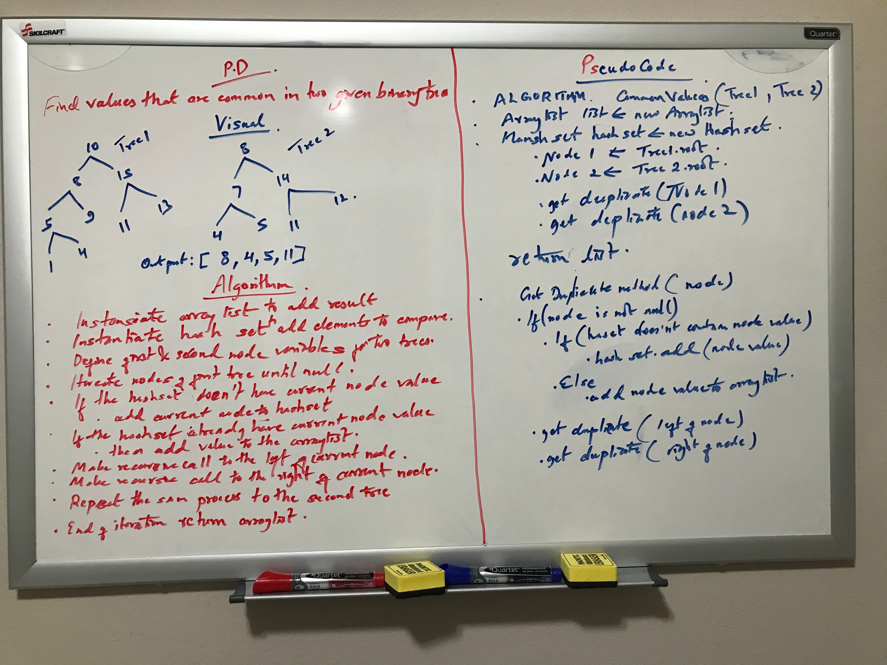

# Challenge Summary
<!-- Short summary or background information -->
Finding common values in two given binary trees

## Challenge Description
<!-- Description of the challenge -->
Without utilizing any of the built-in library methods available to the language, return a set of values found in both 
trees.

## Approach & Efficiency
<!-- What approach did you take? Why? What is the Big O space/time for this approach? -->
While searching through the tree, values are compared before adding to the hashset. If the value already exist in hashset,
then the value is added to the array list. Recursive approach is used to traverse through the node. Space complexity for
this approach is O(n) and time complexity is O(n).

## Solution
<!-- Embedded whiteboard image -->
;