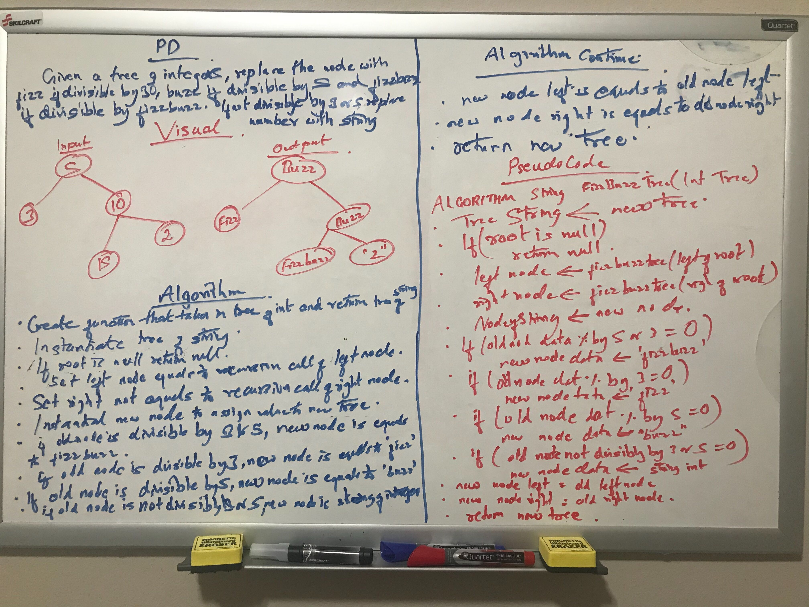

# FizzBuzzTree Summary
<!-- Short summary or background information -->
Converting binary tree of numbers to string.

## Challenge Description
<!-- Description of the challenge -->
Creating a function that converts a given numeric binary tree to string "fizz" if divisible by 3, "buzz" if divisible by 5,
"fizzBuzz" if divisible by both 3 and 5 and if it is not divisible by 3 or 5 then converting the integer number to string 
number.

## Approach & Efficiency
<!-- What approach did you take? Why? What is the Big O space/time for this approach? -->
Original nodes are traversed recursively and at the same time replacement value to each nodes are added to the new tree.
Big O complexity of time for this approach is O(n) because each node is visited to compare and replace the value. 
Big O complexity of space for this approach is O(n) as well because we a creating new tree with the same number of nodes
in original tree. 

## Solution
