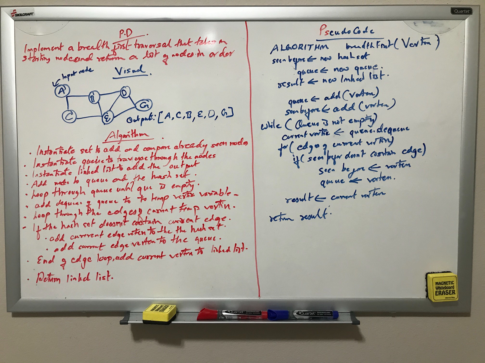
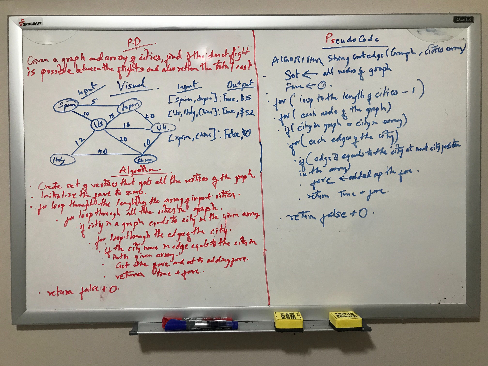
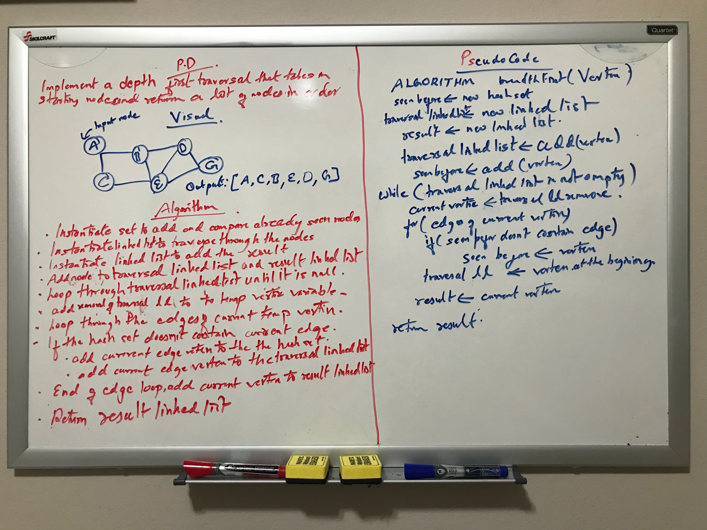

# Code Challenge: 35

## Graphs
<!-- Short summary or background information -->
Implementing a graph that is bidirectional in nature. It stores the elements in the graph as vertices and 
each vertex can have list of edges that it is connected to. 

## Challenge
<!-- Description of the challenge -->
Vertex edges are implemented with the weight passed in by the user. 

## Approach & Efficiency
<!-- What approach did you take? Why? What is the Big O space/time for this approach? -->
graph stores the vertices in a hashset making it a constant time O(1) in addition and retrieval of a vertex.
Space complexity of retrieval is also O(1) as no new space is created for retrieval.

## API
<!-- Description of each method publicly available in your Graph -->
addNode()     : takes in string as a parameter and adds a new vertex to the graph without any connection to the edges.
addEdge()     : takes origin vertex, destination vertex and integer weight as a parameter and 
                adds destination as edges to origin vertex
getNodes()    : gets all the vertices in the graph
getNeighbors(): takes in a vertex for parameter and gets all the edges of that vertex.
size()        : gets the total number of vertices in the graph

# Code Challenge: 36

# Challenge Summary
<!-- Short summary or background information -->
Implementing a breadth first traversal that accepts a starting node and returns a collection of 
nodes in the order they were visited. 

## Challenge Description
<!-- Description of the challenge -->
Breadth first traversal first gets all the edges of the the current node and moves on to the next
node. 

## Approach & Efficiency
<!-- What approach did you take? Why? What is the Big O space/time for this approach? -->
Each visiting node is added to the queue and the hash set to compare and check if the nodes are already visited.
If the nodes are not visited it is added to the queue and linked list. In queue nodes are simultaneous added and 
removed comparing to the linked if they are already in the linked list. Output node is added to the new linked list.
The time cost of this operation is O(n) and space cost is O(n) as well. 

## Solution
<!-- Embedded whiteboard image -->
;

# Code challenge: 37

## Challenge Summary
<!-- Short summary or background information -->
Given a graph, and an array of city names, without utilizing any of the built-in methods available to your 
language, return whether the full trip is possible with direct flights, and how much it would cost.

## Challenge Description
<!-- Description of the challenge -->
The method needs to add total for all the given points in the array, if the the flight is possible. 

## Approach & Efficiency
<!-- What approach did you take? Why? What is the Big O space/time for this approach? -->
The solution uses 3 nested for loops to loop through the the given array of cities, all the cities in a graph
and the edges of the corresponding nodes. The time complexity for this approach is O(n3) and space complexity is
O(n) as all the nodes from graph are placed in a hashset.

## Solution
<!-- Embedded whiteboard image -->
;

# Code Challenge: 38

## Challenge Summary
<!-- Short summary or background information -->
Create a function that accepts an adjacency list as a graph, and conducts a depth first traversal.

## Challenge Description
<!-- Description of the challenge -->
Without utilizing any of the built-in methods available to your language, return a collection of nodes in their pre-order depth-first 
traversal order.

## Approach & Efficiency
<!-- What approach did you take? Why? What is the Big O space/time for this approach? -->
Each visiting node is stored in the linked list and the hash set to compare and check if the nodes are already 
visited. If the nodes are not already visited nodes are added to the hash set and linked list. Nodes are simultaneous 
added to the front of the linked list and removed from the linked list. All the results are added to the new 
linked list. Operation cost of time is O(n) as every nodes are visited to traverse and the the operation cost of 
space is O(n) as new space is created to add the result and do the comparision. 

## Solution
<!-- Embedded whiteboard image -->
;

