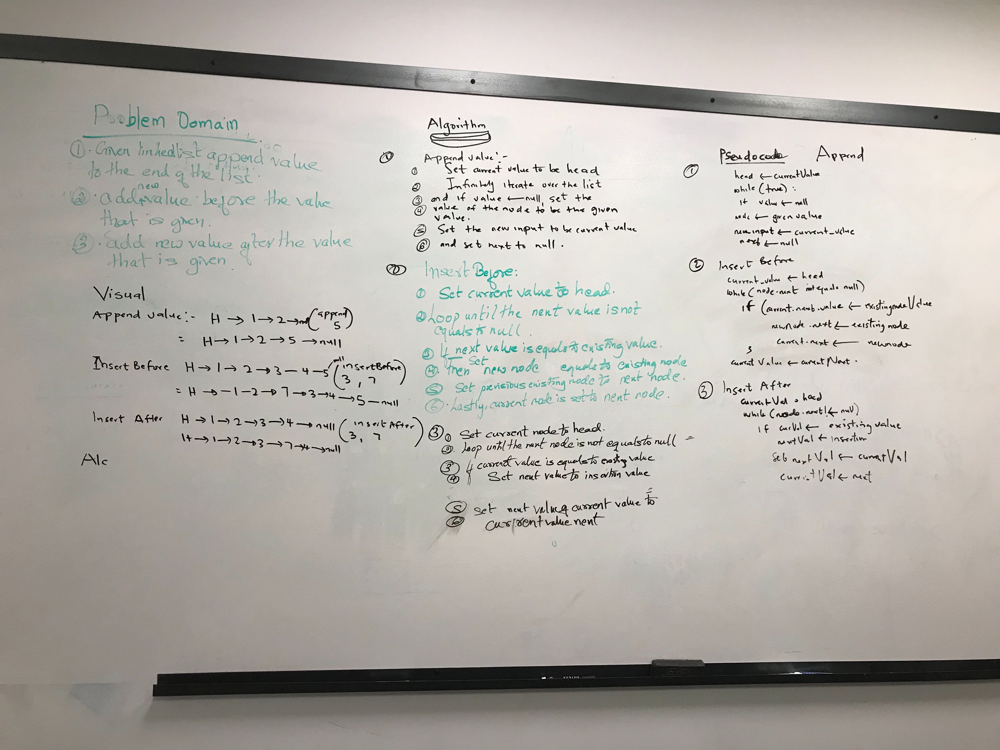
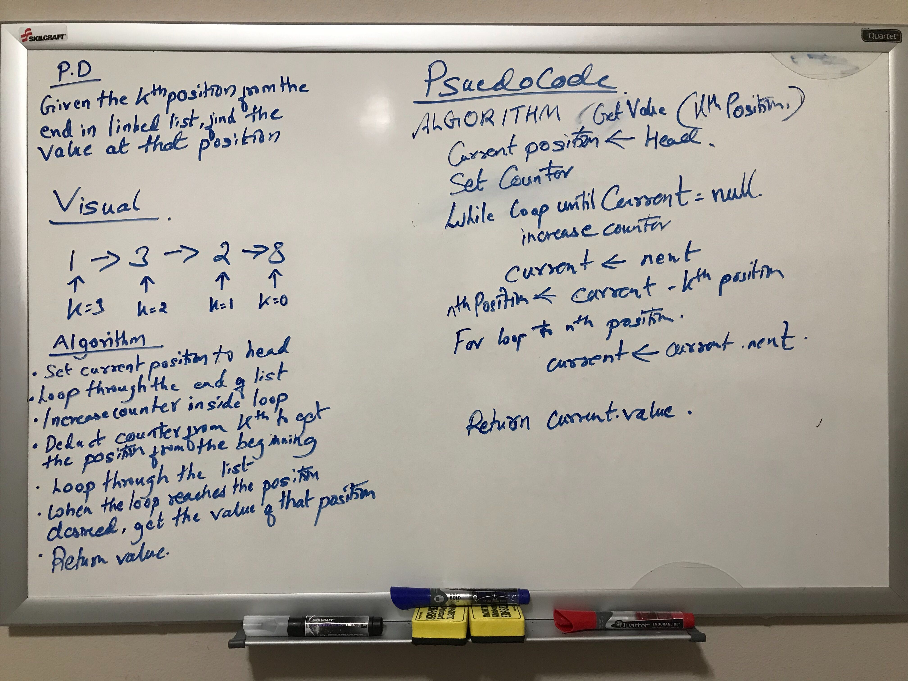
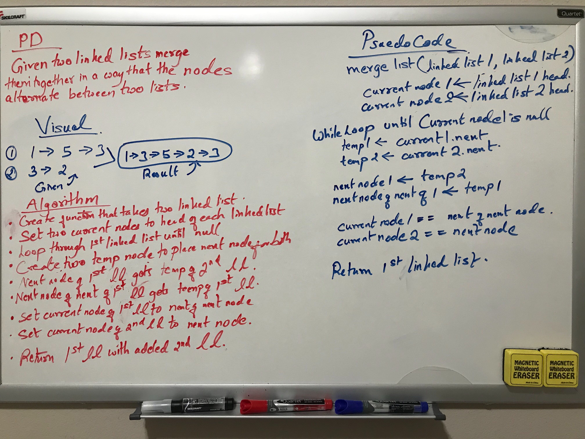

# Challenge Summary
Create a linked list and add several method to the linked list

## Challenge Description
Create methods like insert, includes, toString, append, insertBefore, insertAfter, value at index
starting at the end.

## Approach & Efficiency
<!-- What approach did you take? Why? What is the Big O space/time for this approach? -->
Insert methods adds node to the beginning of the linked list with Big O time of O(1) efficiency. 
Includes methods iterates through the list to find the matching value and return boolean value.
While looping in most of the method current node is set to next node to iterate through the loop. 

## Solution
<!-- Embedded whiteboard image -->

;
;

# Challenge Summary
Merge two linked list together

## Challenge Description
Zipping the two linked lists together into one so that the nodes alternate between the two lists and 
returns a reference to the head of the zipped list.

## Approach & Efficiency
<!-- What approach did you take? Why? What is the Big O space/time for this approach? -->
Creating a temp variable to store the nodes of each linked list and simultaneously assigning to the
next nodes. Since, it has to iterate through each nodes time efficiency is O(n) and it merges the 
two list to one without creating new list so Big O of space is O(1).

## Solution
<!-- Embedded whiteboard image -->

;

