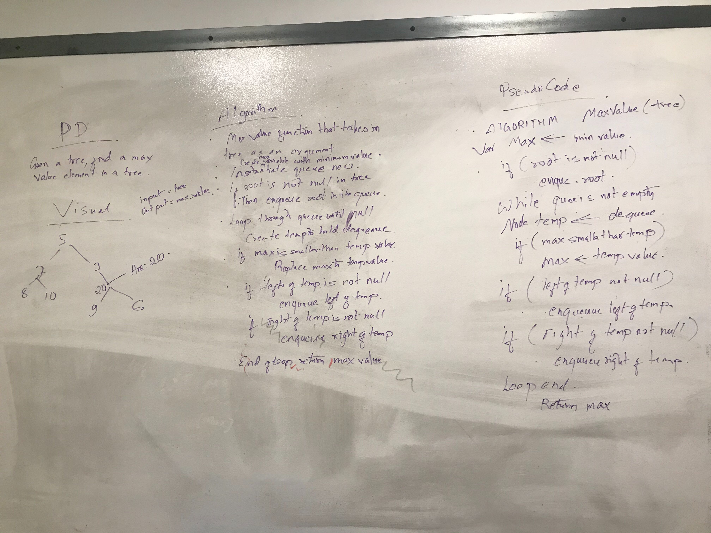

# Challenge Summary
<!-- Short summary or background information -->
Given a tree, find a max value in a tree. 

## Challenge Description
<!-- Description of the challenge -->
Create a method that finds a max value in a given numeric binary tree without utilizing an
any of the built-in methods available in the language. 

## Approach & Efficiency
<!-- What approach did you take? Why? What is the Big O space/time for this approach? -->
Breadth first search approach is used to traverse through the tree. As traversing, nodes 
are added in the the queue, compare the values between the nodes and then dequeued
from the tree. Space complexity is O(1) as no new space is created to find the value.
Time Complexity is O(n) as each nodes are visited to compare the values.

## Solution
<!-- Embedded whiteboard image -->
